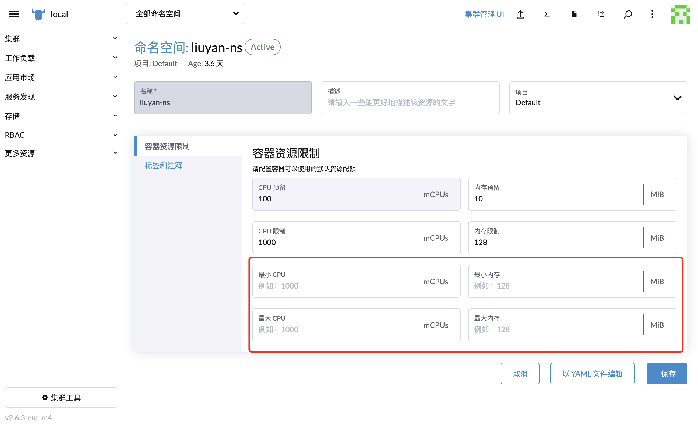
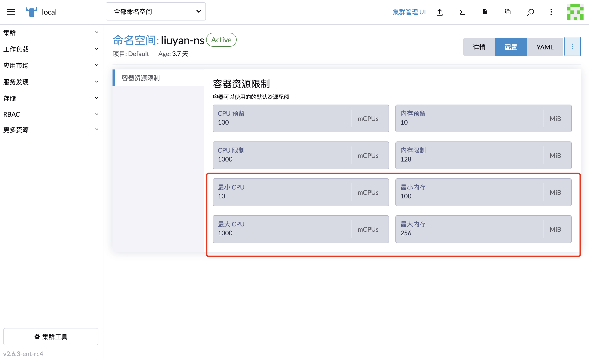

# 容器资源限制（min/max CPU/Memory）

## 业务/功能描述

- 为命名空间中容器和 Pod 使用的 CPU 资源设置最小和最大值。
- 设置命名空间中运行的容器使用的内存的最小值和最大值

## 功能入口描述

- `集群` -> `Project/Namespace` -> `创建项目` -> `容器默认资源限制`
- `集群` -> `Project/Namespace` -> `项目/编辑配置`->`容器默认资源限制`
- `集群` -> `Project/Namespace` -> `命名空间/编辑配置` -> `容器默认资源限制`
- `集群` -> `Project/Namespace` -> `命名空间/配置` -> `容器默认资源限制`

## 前置条件

- 已有集群受 rancher 管理

## API 描述

K8S 原生通过[LimitRange](https://kubernetes.io/docs/reference/generated/kubernetes-api/v1.23/#limitrange-v1-core) 对象指定CPU的最小和最大值，内存的最小和最大值。

Rancher 对容器默认资源限制做了二次封装，通过在命名空间对象上添加`field.cattle.io/containerDefaultResourceLimit`注解实现。注解值是一个`json`对象字符串，`json`对象字符串中还包含`limitsCpu`,`limitsMemory`,`requestsCpu`,`requestsMemory`等命名空间资源限制，其中CPU的最小和最大值限制对应的key是：`minCpu` `maxCpu`，内存的最小和最大值限制对应的key是：`minMemory` `maxMemory`。

示例yaml结构如下，高亮部分是命名空间资源限制注解设置部分：

```yaml{5}
apiVersion: v1
kind: Namespace
metadata:
  annotations:
    field.cattle.io/containerDefaultResourceLimit: '{"limitsCpu":"1000m","limitsMemory":"128Mi","requestsCpu":"100m","requestsMemory":"10Mi","minCpu":"10m","maxCpu":"1000m","minMemory":"100Mi","maxMemory":"256Mi"}'
  name: liuyan-ns
```

:::details 注解 field.cattle.io/containerDefaultResourceLimit 对应的JSON字符串，完整结构
```json
{
  "limitsCpu": "1000m",
  "limitsMemory": "128Mi",
  "requestsCpu": "100m",
  "requestsMemory": "10Mi",
  "minCpu": "10m",
  "maxCpu": "1000m",
  "minMemory": "100Mi",
  "maxMemory": "256Mi"
}
```

:::

参考 K8S 文档 如下：

- [cpu-constraint-namespace](https://kubernetes.io/docs/tasks/administer-cluster/manage-resources/cpu-constraint-namespace/)
- [memory-constraint-namespace](https://kubernetes.io/docs/tasks/administer-cluster/manage-resources/memory-constraint-namespace/)


## 交互用例

1. 保存前，如果限制值为空，UI应该从json对象中删除相关设置key
2. `minCpu` `maxCpu` 只支持单位`m`, `minMemory` `maxMemory` 只支持单位`Mi`，如果修改为其他单位，UI 显示可能会出问题，这是开源版本已经存在的问题
3. 如果没有设置命名空间相应的限制，对应的表单显示 placeholder 提示

4. 命名空间详情页面，`配置/容器资源限制` 标签下，表单应该是禁用状态


