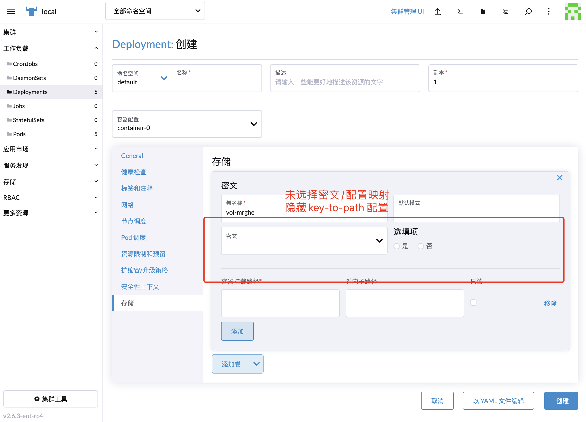
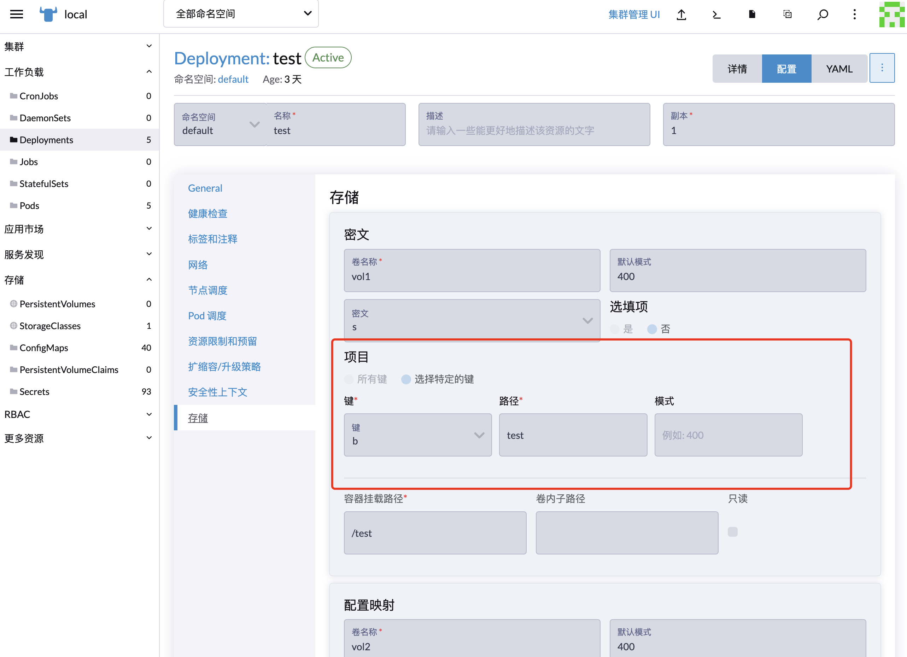

# 密文卷/配置映射卷条目路径设置

## 业务/功能描述

创建/编辑工作负载页面，密文卷/配置映射卷支持配置自定义特定条目所要使用的路径


## 功能入口描述

- `集群` > `工作负载` -> `CronJobs` | `DeamonSets` | `Deployments` | `Jobs` | `StatefulSets` -> `创建`

- `集群` > `工作负载` -> `CronJobs` | `DeamonSets` | `Deployments` | `Jobs` | `StatefulSets` -> `编辑配置`

- `集群` > `工作负载` -> `CronJobs` | `DeamonSets` | `Deployments` | `Jobs` | `StatefulSets` -> `详情/配置`

## 前置条件

- 已有集群受 rancher 管理

## API 描述

工作负载（`CronJobs`, `DeamonSets`, `Deployments`, `Jobs`, `StatefulSets`）添加的密文卷/配置映射卷，在 UI 中需要支持配置自定义特定条目所要使用的路径，具体修改对象位置为下面yaml文件高亮部分：
```yaml{24-26,31-36}
apiVersion: apps/v1
kind: Deployment
metadata:
  name: test
  namespace: default
spec:
  template:
    spec:
      containers:
        - image: ubuntu:xenial
          imagePullPolicy: Always
          name: test
          volumeMounts:
            - mountPath: /test
              name: vol1
            - mountPath: /aaa
              name: vol2
            - mountPath: /test1111
              name: vol3
      volumes:
        - name: vol1
          secret:
            defaultMode: 256
            items:
              - key: b
                path: test
            optional: false
            secretName: s
        - configMap:
            defaultMode: 256
            items:
              - key: a
                path: a
              - key: b
                mode: 400
                path: b
            name: m
            optional: false
          name: vol2
        - name: vol3
          secret:
            defaultMode: 256
            optional: false
            secretName: ss
```

参考 K8S API 如下：

- [configmapvolumesource-v1-core](https://kubernetes.io/docs/reference/generated/kubernetes-api/v1.23/#configmapvolumesource-v1-core)
- [secretvolumesource-v1-core](https://kubernetes.io/docs/reference/generated/kubernetes-api/v1.23/#secretvolumesource-v1-core)
- [keytopath-v1-core](https://kubernetes.io/docs/reference/generated/kubernetes-api/v1.23/#keytopath-v1-core)

## 交互用例

1. 初始添加密文卷/配置映射卷时，如果没有选项对应的密文或配置映射时，对应的`key to path` 配置不显示



2. 选择密文/配置映射后，显示对应的项目选项，有两个选项: `所有键`和`选择特定键`，默认选中`所有键`选项


3. 选择密文/配置映射后，用户在项目下选择`选择特定键`，UI 显示对应配置，默认添加一条空的数据，用户点击添加项目按钮后，UI 需要增加一条空数据，并且用户可以随时删除添加的项目


4. 选择密文/配置映射后，用户在项目下选择`选择特定键`，如果密文/配置映射没有设置key，添加项目按钮禁用，没有默认空数据


5. 切换密文/配置映射后，项目自动选中`所有键`选项，如果之前配置了 `key-to-path`，会全部清空，不可恢复

6. 用户选中项目下`所有键`选项后, 如果之前配置了 `key-to-path`，会全部清空，不可恢复

7. 编辑workload时，能正确显示项目，如果密文/配置映射没有设置key，项目下默认选中`所有键`

8. 如果用户切换命名空间，则清空选择的密文/配置映射，如果用户之前选择的是`选择特定键`，清除所有 `key-to-path` 配置

9. 查看workload 配置时，如果用户设置密文卷/配置映射卷，对应的项目配置不可编辑




::: warning 数据校验说明
  因为基础组件不支持错误提示功能，所以 UI 不对数据的正确性做校验，校验逻辑在后端实现
:::
