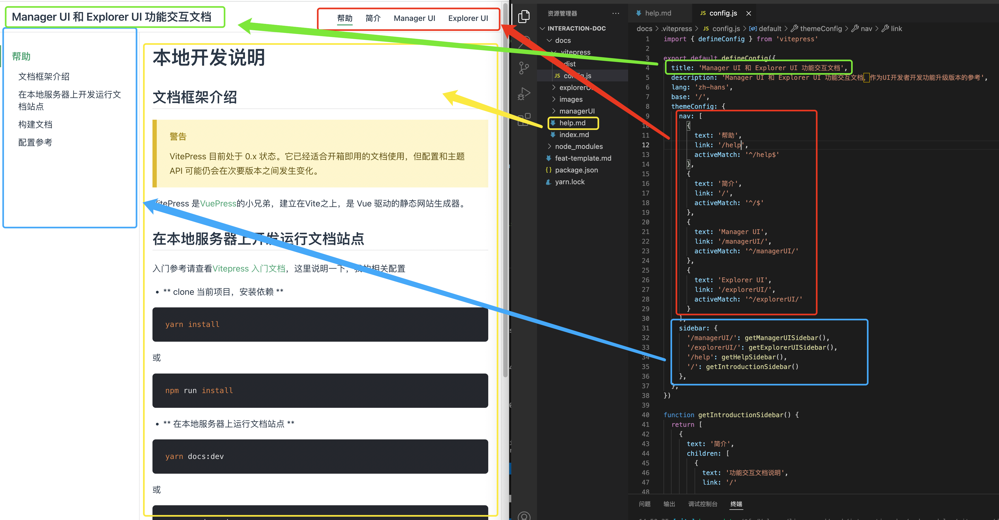

# 本地开发说明

## 文档框架介绍
::: warning 警告
VitePress 目前处于 0.x 状态。它已经适合开箱即用的文档使用，但配置和主题 API 可能仍会在次要版本之间发生变化。
:::

VitePress 是[VuePress](https://vuepress.vuejs.org/zh/)的小兄弟，建立在Vite之上，是 Vue 驱动的静态网站生成器。

## 在本地服务器上开发运行文档站点

入门参考请查看[Vitepress 入门文档](https://vitepress.vuejs.org/guide/getting-started.html)，这里说明一下，我的相关配置

- **clone 当前项目，安装依赖**

```shell
yarn install
```
- **在本地服务器上运行文档站点**
```shell
yarn docs:dev
```

- **在浏览器中访问** `http://localhost:3000`

## 构建文档

运行`yarn docs:build`命令来构建文档。
```shell
yarn docs:build
```

## 配置参考

- 基本配置在 `docs/.vitepress` 目录下，目录结构如下：

```bash
.
├─ docs
│  ├─ .vitepress
│  │  └─ config.js
│  └─ index.md
└─ package.json
```

- 文件`docs/.vitepress/config.js` 配置属性与页面的展示关系如下图：

